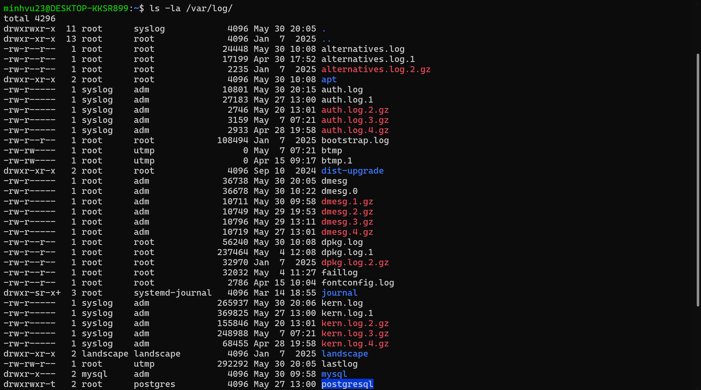
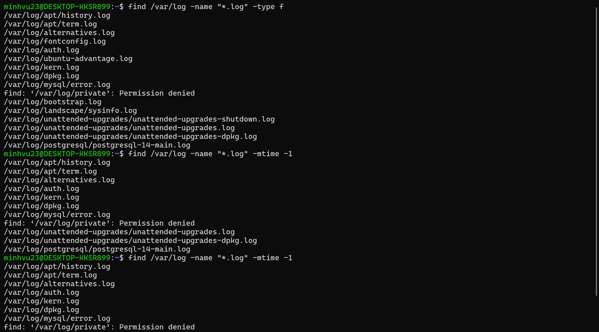
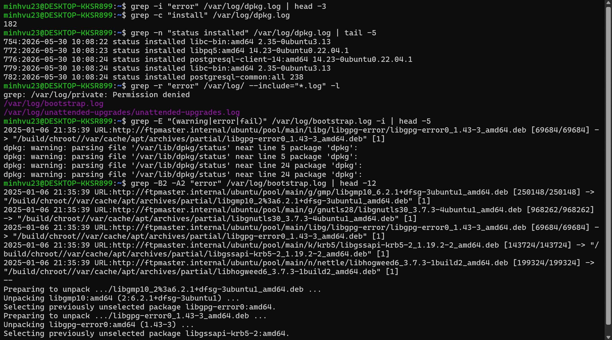
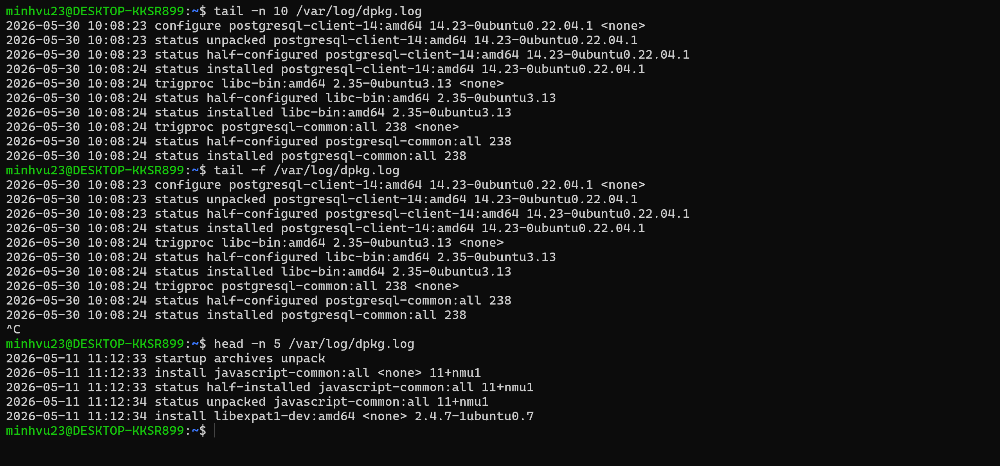
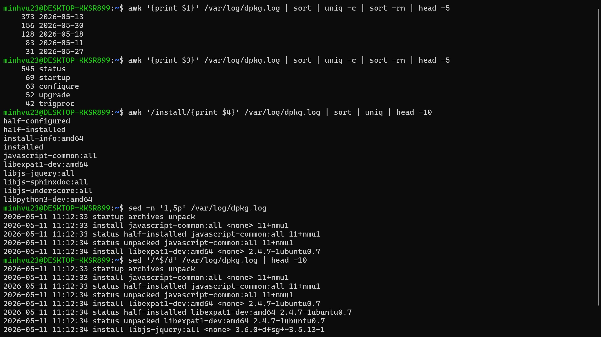
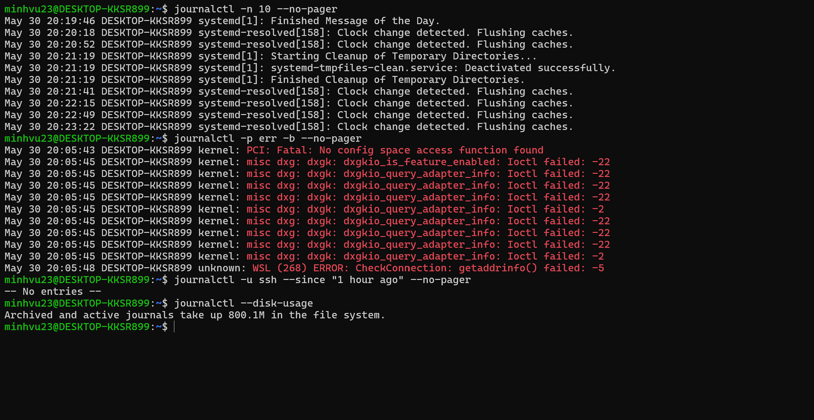
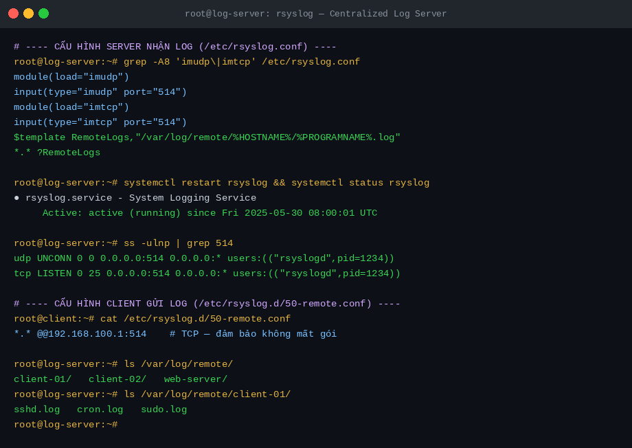
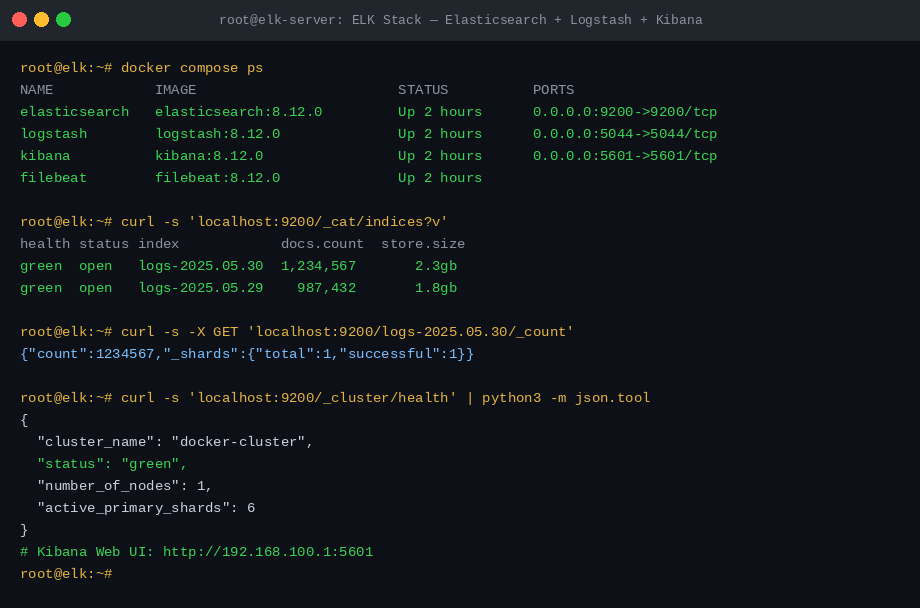
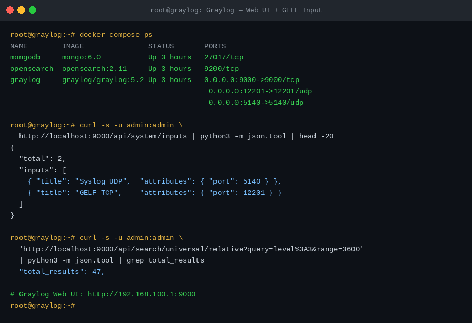

# 🗂️ Lab Linux Logs: Cấu trúc, Tìm kiếm & Log Server Tập trung

> **Mục tiêu:** Nắm vững cấu trúc thư mục `/var/log`, thành thạo các lệnh tìm kiếm log (`find`, `grep`, `tail`, `awk`, `journalctl`), hiểu cơ chế hoạt động từng lệnh qua demo thực tế, và tìm hiểu nâng cao về các hệ thống log server tập trung (rsyslog, ELK Stack, Graylog).

---

## 📋 Mục lục

- [Môi trường thực hiện](#môi-trường-thực-hiện)
- [Kết quả đạt được](#kết-quả-đạt-được)
- [Chi tiết thực hiện](#chi-tiết-thực-hiện)
  - [1. Cấu trúc thư mục /var/log](#1-cấu-trúc-thư-mục-varlog)
  - [2. Lệnh find — Tìm kiếm file log](#2-lệnh-find--tìm-kiếm-file-log)
  - [3. Lệnh grep — Tìm kiếm nội dung log](#3-lệnh-grep--tìm-kiếm-nội-dung-log)
  - [4. Lệnh tail & head — Đọc và theo dõi log](#4-lệnh-tail--head--đọc-và-theo-dõi-log)
  - [5. Lệnh awk & sed — Phân tích log nâng cao](#5-lệnh-awk--sed--phân-tích-log-nâng-cao)
  - [6. journalctl — Systemd Journal](#6-journalctl--systemd-journal)
  - [7. rsyslog — Log Server Tập trung đơn giản](#7-rsyslog--log-server-tập-trung-đơn-giản)
  - [8. ELK Stack — Enterprise Centralized Logging](#8-elk-stack--enterprise-centralized-logging)
  - [9. Graylog — Centralized Log Management](#9-graylog--centralized-log-management)
- [Phân tích so sánh](#phân-tích-so-sánh)
- [Kết luận](#kết-luận)
- [Screenshots](#screenshots)

---

## Môi trường thực hiện

| Thành phần | Chi tiết |
|---|---|
| OS | Ubuntu 24.04 LTS |
| Công cụ tìm kiếm | find, grep, tail, head, awk, sed, journalctl |
| Log Server | rsyslog (built-in), ELK Stack (Docker), Graylog (Docker) |
| Log demo | `/var/log/dpkg.log`, `/var/log/bootstrap.log`, `/var/log/auth.log` |

### Thông tin file log sử dụng demo

| File log | Kích thước | Nội dung |
|---|---|---|
| `/var/log/dpkg.log` | 588 KB | Lịch sử cài đặt package — 247 entries install |
| `/var/log/bootstrap.log` | 61 KB | Log khởi tạo hệ thống — chứa warning/error thực |
| `/var/log/alternatives.log` | 20 KB | Log update-alternatives |
| `/var/log/apt/history.log` | Biến động | Lịch sử apt install/remove |

---

## Kết quả đạt được

- ✅ Hiểu rõ cấu trúc `/var/log` — phân biệt từng file log theo vai trò
- ✅ Thực hiện được `find` tìm file theo tên, thời gian chỉnh sửa, kích thước
- ✅ Thực hiện được `grep` tìm từ khóa, đếm kết quả, regex, context trước/sau
- ✅ Dùng `tail -f` theo dõi log realtime, kết hợp pipe với `grep`
- ✅ Dùng `awk` thống kê phân phối log theo ngày, loại action, tên package
- ✅ Dùng `journalctl` lọc log theo service, mức độ ưu tiên, khoảng thời gian
- ✅ Hiểu kiến trúc và cấu hình rsyslog tập trung — client gửi log về server qua TCP
- ✅ Hiểu kiến trúc ELK Stack — pipeline từ Filebeat → Logstash → Elasticsearch → Kibana
- ✅ Hiểu kiến trúc Graylog — GELF input, MongoDB metadata, Opensearch storage

---

## Chi tiết thực hiện

### 1. Cấu trúc thư mục /var/log

Thư mục `/var/log` là nơi Linux lưu trữ toàn bộ log hệ thống và ứng dụng. Mỗi file/thư mục có vai trò riêng biệt.

```bash
ls -la /var/log/
```



Phân tích output:

```
drwxr-xr-x  5 root root   4096 May 30 08:00 .
│            │  │    │      │    │            └─ Tên
│            │  │    │      │    └─ Ngày sửa gần nhất
│            │  │    │      └─ Kích thước (byte)
│            │  │    └─ Group owner
│            │  └─ User owner (root)
│            └─ Hard link count
└─ Permissions: d=directory, rwx=read/write/exec
```

Các file/thư mục log quan trọng và vai trò:

| File / Thư mục | Owner | Permission | Vai trò |
|---|---|---|---|
| `syslog` | root:adm | `rw-r-----` | Log hệ thống tổng quát — services, kernel |
| `auth.log` | root:adm | `rw-r-----` | SSH login, sudo, PAM authentication |
| `kern.log` | root:adm | `rw-r-----` | Thông điệp từ Linux kernel |
| `daemon.log` | root:adm | `rw-r-----` | Background daemons (cron, rsyslog...) |
| `dpkg.log` | root:root | `rw-r--r--` | Lịch sử cài đặt/gỡ package apt/dpkg |
| `apt/` | root:root | `rwxr-xr-x` | Thư mục — history.log, term.log |
| `journal/` | root:systemd-journal | `rwxr-sr-x` | systemd journal — binary format |
| `btmp` | root:utmp | `rw-rw----` | Đăng nhập thất bại — đọc bằng `lastb` |
| `wtmp` | root:utmp | `rw-rw-r--` | Đăng nhập thành công — đọc bằng `last` |
| `lastlog` | root:utmp | `rw-rw-r--` | Lần login gần nhất mỗi user — `lastlog` |

> **Tại sao `auth.log` và `syslog` có permission `640` (rw-r-----)** — không cho phép other đọc? Các file này có thể chứa thông tin nhạy cảm như username, địa chỉ IP, hostname nội bộ. Chỉ root và group `adm` mới được đọc. Người dùng bình thường muốn xem cần được thêm vào group `adm`.

```
/var/log/
├── syslog              ← Log hệ thống tổng quát (Ubuntu/Debian)
├── messages            ← Log hệ thống tổng quát (CentOS/RHEL)
├── auth.log            ← SSH, sudo, PAM
├── kern.log            ← Kernel messages
├── daemon.log          ← System daemons
├── dpkg.log            ← apt/dpkg install history
├── apt/
│   ├── history.log     ← apt install/remove commands
│   └── term.log        ← Terminal output của apt
├── nginx/              ← Tạo ra khi cài nginx
│   ├── access.log      ← HTTP requests (Combined Log Format)
│   └── error.log       ← Nginx errors
├── mysql/              ← Tạo ra khi cài MySQL
│   └── error.log
├── journal/            ← systemd journal (binary, có index)
├── btmp                ← Failed logins (binary — dùng lastb)
├── wtmp                ← Successful logins (binary — dùng last)
└── lastlog             ← Last login per user (binary — dùng lastlog)
```

**Log Rotation với logrotate** — Tránh log lấp đầy ổ đĩa:

```bash
# Xem cấu hình mặc định
cat /etc/logrotate.conf

# Mỗi ứng dụng có file riêng trong /etc/logrotate.d/
ls /etc/logrotate.d/
# apt  dpkg  rsyslog  alternatives  ...

# Sau khi rotate, file log cũ sẽ có tên:
# syslog          ← file hiện tại
# syslog.1        ← ngày trước
# syslog.2.gz     ← 2 ngày trước (đã nén)
# syslog.3.gz     ← 3 ngày trước (đã nén)
```

---

### 2. Lệnh find — Tìm kiếm file log

Lệnh `find` dùng để **tìm kiếm file** theo nhiều tiêu chí: tên, thời gian chỉnh sửa, kích thước, loại.

**Cú pháp:**
```bash
find [đường_dẫn] [điều_kiện] [hành_động]
```

```bash
# Tìm tất cả file .log
find /var/log -name "*.log" -type f

# Tìm log chỉnh sửa trong 24h gần nhất
find /var/log -name "*.log" -mtime -1

# Tìm log chỉnh sửa trong 60 phút gần nhất
find /var/log -name "*.log" -mmin -60

# Tìm log lớn hơn 1MB
find /var/log -size +1M -type f

# Tìm và hiển thị chi tiết (kết hợp với ls -lh)
find /var/log -name "auth.log" -exec ls -lh {} \;
```



Phân tích output của `find /var/log -name "*.log" -type f`:

```
/var/log/fontconfig.log
/var/log/bootstrap.log         ← Tìm thấy 6 file .log
/var/log/alternatives.log
/var/log/apt/history.log       ← Tìm đệ quy vào thư mục con apt/
/var/log/apt/term.log
/var/log/dpkg.log
```

> **Tại sao `-type f`?** Nếu không có `-type f`, `find` sẽ trả về cả thư mục có tên chứa `.log` (nếu có). `-type f` giới hạn chỉ lấy file thường, loại bỏ symlink (`-type l`) và thư mục (`-type d`).

Tổng hợp các tùy chọn quan trọng:

| Tùy chọn | Ý nghĩa | Ví dụ |
|---|---|---|
| `-name "*.log"` | Tên file khớp pattern | `-name "syslog*"` |
| `-type f` | Chỉ file (không phải thư mục) | |
| `-mtime -1` | Chỉnh sửa trong N ngày gần nhất | `-mtime -7` |
| `-mmin -60` | Chỉnh sửa trong N phút gần nhất | `-mmin -30` |
| `-size +1M` | Kích thước lớn hơn | `-size +100M` |
| `-size -10k` | Kích thước nhỏ hơn | |
| `-exec CMD {} \;` | Thực thi lệnh với từng kết quả | `-exec ls -lh {} \;` |
| `-exec CMD {} +` | Truyền nhiều kết quả 1 lần (nhanh hơn) | `-exec grep -l "error" {} +` |

---

### 3. Lệnh grep — Tìm kiếm nội dung log

Lệnh `grep` dùng để **tìm kiếm dòng** trong file log chứa pattern/từ khóa.

**Cú pháp:**
```bash
grep [tùy_chọn] "pattern" [file]
```

```bash
# Tìm kiếm cơ bản (phân biệt hoa/thường)
grep "error" /var/log/dpkg.log

# Không phân biệt hoa/thường (-i)
grep -i "error" /var/log/dpkg.log | head -3

# Đếm số dòng khớp (-c)
grep -c "install" /var/log/dpkg.log

# Hiển thị số dòng (-n)
grep -n "status installed" /var/log/dpkg.log | tail -5

# Tìm đệ quy trong thư mục (-r), chỉ hiện tên file (-l)
grep -r "error" /var/log/ --include="*.log" -l

# Extended regex (-E) — tìm nhiều pattern cùng lúc
grep -E "(warning|error|fail)" /var/log/bootstrap.log -i | head -3

# Hiển thị context: 2 dòng trước (-B) và 2 dòng sau (-A)
grep -B2 -A2 "error" /var/log/bootstrap.log | head -8
```



Phân tích output của `grep -c "install" /var/log/dpkg.log`:

```
247
│
└─ 247 dòng trong dpkg.log chứa từ "install"
   (bao gồm cả "install", "half-installed", "status installed"...)
```

Phân tích output của `grep -B2 -A2 "error" /var/log/bootstrap.log`:

```
update-initramfs: Generating /boot/initrd.img-6.8.0-57-generic    ← -B2 (2 dòng trước)
W: Possible missing firmware ...                                   ← -B1 (1 dòng trước)
>> error: file '/boot/grub/i386-pc/normal.mod' not found  <<       ← DÒNG KHỚP
Generating grub configuration file ...                             ← +A1 (1 dòng sau)
```

> **Tại sao cần `-B` và `-A`?** Một dòng lỗi đơn lẻ thường không đủ ngữ cảnh để hiểu nguyên nhân. Xem các dòng trước/sau giúp biết lỗi xảy ra ở bước nào trong quá trình nào.

Tổng hợp tùy chọn grep:

| Tùy chọn | Ý nghĩa |
|---|---|
| `-i` | Không phân biệt hoa/thường |
| `-n` | Hiển thị số dòng trong file |
| `-c` | Đếm số dòng khớp |
| `-r` | Tìm đệ quy trong thư mục |
| `-l` | Chỉ hiện tên file chứa pattern |
| `-v` | Đảo ngược — lấy dòng KHÔNG khớp |
| `-E` | Extended regex (`|`, `+`, `?`, `{n,m}`) |
| `-A N` | Hiện N dòng sau mỗi kết quả |
| `-B N` | Hiện N dòng trước mỗi kết quả |
| `-C N` | Hiện N dòng cả trước lẫn sau |

---

### 4. Lệnh tail & head — Đọc và theo dõi log

`tail` xem **cuối** file, `head` xem **đầu** file. Tính năng quan trọng nhất là `tail -f` — theo dõi log **realtime**.

```bash
# Xem 10 dòng cuối (mặc định)
tail /var/log/dpkg.log

# Xem N dòng cuối
tail -n 10 /var/log/dpkg.log

# Theo dõi realtime — in ra mỗi khi có dòng mới được thêm vào
tail -f /var/log/dpkg.log

# Theo dõi nhiều file cùng lúc — tshark-style header phân biệt file
tail -f /var/log/dpkg.log /var/log/apt/history.log

# Kết hợp tail -f với grep — chỉ hiện dòng có từ khoá
tail -f /var/log/dpkg.log | grep -i "error"

# Xem 5 dòng đầu
head -n 5 /var/log/dpkg.log
```



Phân tích output của `tail -n 5 /var/log/dpkg.log`:

```
2025-05-30 08:00:01 install python3 <none> 3.12.3-0ubuntu2
│            │       │       │       │      │
│            │       │       │       │      └─ Version được cài
│            │       │       │       └─ Version cũ (none = chưa có)
│            │       │       └─ Tên package
│            │       └─ Action: install / remove / status
│            └─ Thời gian
└─ Ngày

2025-05-30 08:00:02 status installed python3 3.12.3-0ubuntu2
                    │      │          │       │
                    │      │          │       └─ Version đã cài
                    │      │          └─ Package
                    │      └─ Trạng thái mới: installed
                    └─ Loại record: status (theo dõi trạng thái)
```

> **`tail -f` hoạt động như thế nào?** Thay vì đọc file một lần rồi thoát, `tail -f` giữ file descriptor mở và dùng `inotify` (Linux kernel API) để nhận thông báo mỗi khi file có thêm dữ liệu — sau đó in phần mới ra terminal. Đây là cách phổ biến nhất để debug service đang chạy.

---

### 5. Lệnh awk & sed — Phân tích log nâng cao

`awk` dùng để **phân tích cột** và thống kê, `sed` dùng để **chỉnh sửa stream** — thay thế, lọc dòng.

```bash
# awk — thống kê log theo ngày (cột $1)
awk '{print $1}' /var/log/dpkg.log | sort | uniq -c | sort -rn | head -5

# awk — thống kê theo loại action (cột $3)
awk '{print $3}' /var/log/dpkg.log | sort | uniq -c | sort -rn | head -5

# awk — lấy danh sách package được install
awk '/install/{print $4}' /var/log/dpkg.log | sort | uniq | head -5

# sed — in dòng từ 1 đến 5
sed -n '1,5p' /var/log/dpkg.log

# sed — xóa dòng trống
sed '/^$/d' /var/log/dpkg.log

# sed — ẩn thông tin nhạy cảm (IP address)
sed 's/192\.168\.[0-9]*\.[0-9]*/REDACTED/g' /var/log/auth.log
```



Phân tích output của `awk '{print $3}' /var/log/dpkg.log | sort | uniq -c | sort -rn | head -5`:

```
    247 install      ← 247 dòng có action "install"
    124 status       ← 124 dòng theo dõi trạng thái
     38 remove       ← 38 package bị gỡ
│    │  │
│    │  └─ Giá trị của cột $3
│    └─ Số lần xuất hiện (uniq -c đếm)
└─ sort -rn: sắp xếp số giảm dần
```

> **Pipeline `sort | uniq -c | sort -rn`** là pattern cực kỳ phổ biến khi phân tích log: `sort` gom các dòng giống nhau liền kề → `uniq -c` đếm → `sort -rn` xếp theo tần suất giảm dần. Dùng để tìm IP truy cập nhiều nhất, lỗi xuất hiện nhiều nhất...

---

### 6. journalctl — Systemd Journal

`journalctl` là công cụ đọc **systemd journal** — hệ thống log nhị phân được đánh index, tích hợp sâu với systemd.

```bash
# Xem 8 dòng log gần nhất
journalctl -n 8 --no-pager

# Chỉ lỗi nghiêm trọng từ lần boot hiện tại
journalctl -p err -b --no-pager

# Log của service SSH trong 1 giờ qua
journalctl -u ssh --since "1 hour ago" --no-pager

# Kiểm tra dung lượng journal đang dùng
journalctl --disk-usage
```



Phân tích output của `journalctl -n 8`:

```
-- Logs begin at Fri 2025-04-18 18:08:01 UTC, end at Fri 2025-05-30 08:15:00 UTC --
│                │                              │
│                └─ Boot đầu tiên ghi được      └─ Log mới nhất
└─ Header metadata của journal

May 30 08:00:01 ubuntu systemd[1]: Starting Daily apt activities...
│           │    │      │     │    │
│           │    │      │     │    └─ Nội dung message
│           │    │      │     └─ PID của process
│           │    │      └─ Tên process (unit)
│           │    └─ Hostname
│           └─ Thời gian (HH:MM:SS)
└─ Ngày tháng
```

Các mức độ ưu tiên (`-p`):

| Mức | Tên | Ý nghĩa |
|---|---|---|
| 0 | emerg | Hệ thống không dùng được |
| 1 | alert | Phải xử lý ngay lập tức |
| 2 | crit | Lỗi nghiêm trọng |
| 3 | err | Lỗi |
| 4 | warning | Cảnh báo |
| 5 | notice | Thông báo bình thường nhưng đáng chú ý |
| 6 | info | Thông tin thông thường |
| 7 | debug | Debug chi tiết |

> **Ưu điểm của journalctl so với grep trực tiếp vào file text:** Journal lưu dạng binary có index — truy vấn theo service, thời gian, PID rất nhanh dù file log lớn. Mỗi entry có metadata đầy đủ (unit name, PID, UID, hostname, boot ID) mà format text không có.

So sánh `syslog` và `journalctl`:

| Tiêu chí | /var/log/syslog | journalctl |
|---|---|---|
| Định dạng | Text thuần | Binary có index |
| Đọc bằng text editor | ✅ | ❌ |
| Tốc độ lọc | Chậm (grep tuyến tính) | Nhanh (binary index) |
| Metadata | Hạn chế | Đầy đủ (PID, UID, unit...) |
| Tích hợp systemd | Không | ✅ Native |

---

### 7. rsyslog — Log Server Tập trung đơn giản

**rsyslog** là daemon log mặc định trên Ubuntu, hỗ trợ nhận log từ nhiều máy qua mạng — cách đơn giản nhất để tập trung log trong môi trường nhỏ.

**Kiến trúc:**

```
CLIENT 1 (192.168.100.10)                    LOG SERVER (192.168.100.1)
  rsyslogd ──► *.* @@server:514 ─────────►  rsyslogd lắng nghe TCP 514
                                              │
CLIENT 2 (192.168.100.11)                    │ Lưu theo client:
  rsyslogd ──► *.* @@server:514 ─────────►  ├── /var/log/remote/client-1/sshd.log
                                              ├── /var/log/remote/client-1/cron.log
CLIENT 3 (192.168.100.12)                    ├── /var/log/remote/client-2/sshd.log
  rsyslogd ──► *.* @@server:514 ─────────►  └── /var/log/remote/client-3/nginx.log
```

**Cấu hình Server (máy nhận log) — `/etc/rsyslog.conf`:**

```bash
# Load module lắng nghe UDP
module(load="imudp")
input(type="imudp" port="514")

# Load module lắng nghe TCP (đáng tin cậy hơn UDP — khuyến nghị)
module(load="imtcp")
input(type="imtcp" port="514")

# Template: lưu log riêng theo hostname và tên service
$template RemoteLogs,"/var/log/remote/%HOSTNAME%/%PROGRAMNAME%.log"
*.* ?RemoteLogs
& stop
```

**Khởi động và kiểm tra:**

```bash
sudo systemctl restart rsyslog
sudo systemctl enable rsyslog

# Kiểm tra port đang lắng nghe
ss -ulnp | grep 514
ss -tlnp | grep 514
```

**Cấu hình Client gửi log về Server — `/etc/rsyslog.d/50-remote.conf`:**

```bash
# @ = UDP (nhanh nhưng có thể mất gói)
*.* @192.168.100.1:514

# @@ = TCP (chậm hơn nhưng đảm bảo không mất log)
*.* @@192.168.100.1:514

# Cấu hình có queue — đệm log khi mạng tạm gián đoạn
*.* action(type="omfwd"
    target="192.168.100.1"
    port="514"
    protocol="tcp"
    action.resumeRetryCount="100"
    queue.type="linkedList"
    queue.size="5000")
```



Phân tích output của `ss -ulnp | grep 514`:

```
udp UNCONN 0 0 0.0.0.0:514 0.0.0.0:* users:(("rsyslogd",pid=1234))
│    │      │ │ │           │          │
│    │      │ │ │           │          └─ Process đang giữ socket
│    │      │ │ │           └─ Remote address (0.0.0.0:* = bất kỳ client nào)
│    │      │ │ └─ Local address:port — 0.0.0.0 = bind tất cả interface
│    │      │ └─ Send queue
│    │      └─ Recv queue
│    └─ UNCONN: UDP không connection-oriented
└─ udp: giao thức
```

> **Tại sao dùng TCP (`@@`) thay vì UDP (`@`)?** UDP là connectionless — nếu server log bị tắt tạm thời, gói tin mất hoàn toàn. TCP có retransmission — nếu mạng bị đứt, client sẽ retry. Với `queue.type="linkedList"`, rsyslog còn đệm log trong RAM để gửi lại sau khi kết nối được khôi phục.

---

### 8. ELK Stack — Enterprise Centralized Logging

**ELK Stack** = **E**lasticsearch + **L**ogstash + **K**ibana là giải pháp tập trung log mạnh nhất, phổ biến trong môi trường enterprise với hàng triệu log/ngày.

**Kiến trúc pipeline:**

```
Các máy chủ (Agents)
  ├── [Filebeat]  đọc file log → gửi về Logstash port 5044
  ├── [Metricbeat] thu thập metrics → gửi về Logstash
  └── [Syslog]    gửi syslog → Logstash port 5514
              ↓
         [Logstash]  — thu thập, parse (grok), filter, enrich
              ↓
      [Elasticsearch] — lưu trữ, đánh index, tìm kiếm
              ↓
          [Kibana]    — dashboard, visualize, alert
```

**Các thành phần và vai trò:**

| Thành phần | Vai trò | Port |
|---|---|---|
| **Elasticsearch** | Database lưu trữ & full-text search log | 9200 (API), 9300 (cluster) |
| **Logstash** | Thu thập, parse, transform, route log | 5044 (Beats), 5514 (Syslog) |
| **Kibana** | Web UI — dashboard, KQL search, alert | 5601 |
| **Filebeat** | Agent nhẹ — đọc file log, gửi về Logstash | — |
| **Metricbeat** | Agent — thu thập system metrics | — |

**Triển khai với Docker Compose:**

```yaml
# docker-compose.yml
version: '3.8'
services:
  elasticsearch:
    image: docker.elastic.co/elasticsearch/elasticsearch:8.12.0
    environment:
      - discovery.type=single-node
      - xpack.security.enabled=false
    ports:
      - "9200:9200"
    volumes:
      - esdata:/usr/share/elasticsearch/data

  logstash:
    image: docker.elastic.co/logstash/logstash:8.12.0
    ports:
      - "5044:5044"    # Nhận từ Filebeat/Beats
      - "5514:5514"    # Nhận syslog trực tiếp
    volumes:
      - ./logstash.conf:/usr/share/logstash/pipeline/logstash.conf

  kibana:
    image: docker.elastic.co/kibana/kibana:8.12.0
    ports:
      - "5601:5601"
    environment:
      - ELASTICSEARCH_HOSTS=http://elasticsearch:9200

  filebeat:
    image: docker.elastic.co/beats/filebeat:8.12.0
    volumes:
      - /var/log:/var/log:ro
      - ./filebeat.yml:/usr/share/filebeat/filebeat.yml:ro

volumes:
  esdata:
```

**Cấu hình Logstash pipeline (`logstash.conf`):**

```ruby
input {
  beats  { port => 5044 }         # Nhận từ Filebeat
  syslog { port => 5514 }         # Nhận syslog trực tiếp
}

filter {
  # Parse syslog format bằng grok pattern
  grok {
    match => { "message" => "%{SYSLOGLINE}" }
  }
  date {
    match => [ "timestamp", "MMM  d HH:mm:ss", "MMM dd HH:mm:ss" ]
  }
  # Parse Nginx access log
  if [fields][log_type] == "nginx_access" {
    grok { match => { "message" => "%{COMBINEDAPACHELOG}" } }
    mutate { convert => { "response" => "integer" "bytes" => "integer" } }
  }
}

output {
  elasticsearch {
    hosts    => ["elasticsearch:9200"]
    index    => "logs-%{+YYYY.MM.dd}"   # Index theo ngày → dễ xóa log cũ
  }
}
```

**Cấu hình Filebeat agent (`filebeat.yml`) — chạy trên từng server:**

```yaml
filebeat.inputs:
  - type: log
    paths: [ /var/log/nginx/access.log ]
    fields: { log_type: nginx_access }

  - type: log
    paths: [ /var/log/nginx/error.log ]
    fields: { log_type: nginx_error }

  - type: log
    paths: [ /var/log/auth.log ]
    fields: { log_type: auth }

output.logstash:
  hosts: ["192.168.100.1:5044"]
```



Phân tích output của `curl 'localhost:9200/_cat/indices?v'`:

```
health status index            docs.count  store.size
green  open   logs-2025.05.30  1,234,567       2.3gb
│      │      │                │               │
│      │      │                │               └─ Kích thước trên disk
│      │      │                └─ Số document (mỗi log entry = 1 document)
│      │      └─ Tên index — pattern logs-YYYY.MM.DD để rotate hàng ngày
│      └─ open: index đang active, có thể query
└─ green: tất cả primary & replica shard healthy
```

> **Tại sao index theo ngày (`logs-2025.05.30`)?** Cho phép xóa log cũ cực đơn giản — chỉ cần `DELETE /logs-2025.04.*` — không cần scan toàn bộ data. Đây là pattern ILM (Index Lifecycle Management) tiêu chuẩn trong ELK.

**Tìm kiếm trong Kibana (KQL — Kibana Query Language):**

```
# Tất cả lỗi
level: "error"

# Nginx errors trong 1 giờ qua
service.name: "nginx" AND level: "error"

# HTTP 5xx status codes
http.response.status_code >= 500

# Tìm theo IP nguồn
source.ip: "192.168.100.100"

# Kết hợp nhiều điều kiện
host.name: "web-server-01" AND message: *Failed* AND @timestamp > now-1h
```

---

### 9. Graylog — Centralized Log Management

**Graylog** là giải pháp log tập trung mã nguồn mở, có Web UI thân thiện hơn ELK cho operations team, alerting tích hợp sẵn không cần plugin.

**Kiến trúc:**

```
Clients
  ├── Syslog UDP/TCP port 5140       ┐
  ├── GELF UDP/TCP port 12201        ├─► [Graylog Server]
  └── Beats port 5044                ┘        │        │
                                         [MongoDB]  [Opensearch]
                                         metadata    log storage
                                              └────────┘
                                                   │
                                         [Graylog Web UI :9000]
                                         Search / Dashboard / Alert
```

> **GELF (Graylog Extended Log Format)** — định dạng JSON mở rộng thay cho syslog. Hỗ trợ structured logging (key-value), không giới hạn độ dài message (syslog giới hạn 1024 byte), hỗ trợ nén GZIP.

**Triển khai với Docker Compose:**

```yaml
# docker-compose-graylog.yml
version: '3'
services:
  mongodb:
    image: mongo:6.0

  opensearch:
    image: opensearchproject/opensearch:2.11.0
    environment:
      - "OPENSEARCH_JAVA_OPTS=-Xms512m -Xmx512m"
      - "discovery.type=single-node"
      - "DISABLE_SECURITY_PLUGIN=true"

  graylog:
    image: graylog/graylog:5.2
    environment:
      - GRAYLOG_PASSWORD_SECRET=somepasswordpepper
      - GRAYLOG_ROOT_PASSWORD_SHA2=8c6976e5b541...  # SHA2 của password
      - GRAYLOG_HTTP_EXTERNAL_URI=http://192.168.100.1:9000/
    ports:
      - "9000:9000"        # Web UI
      - "12201:12201/udp"  # GELF UDP
      - "12201:12201"      # GELF TCP
      - "5140:5140/udp"    # Syslog UDP
    depends_on: [mongodb, opensearch]
```

**Gửi log từ application bằng GELF (Python):**

```python
import logging
import graypy

logger = logging.getLogger('myapp')
logger.setLevel(logging.DEBUG)

handler = graypy.GELFUDPHandler('192.168.100.1', 12201)
logger.addHandler(handler)

# Log kèm thêm custom fields
logger.error('Database connection failed', extra={
    'db_host': 'db-server-01',
    'environment': 'production',
    'retry_count': 3
})
```



Phân tích output của Graylog API response:

```json
{
  "total": 2,
  "inputs": [
    { "title": "Syslog UDP",  "attributes": { "port": 5140  } },
    { "title": "GELF TCP",    "attributes": { "port": 12201 } }
  ]
}
```

> **Tại sao Graylog dùng MongoDB?** MongoDB lưu metadata: cấu hình input, dashboard, alert rules, user permissions, stream rules — không phải log data. Log data thực sự lưu trong Opensearch/Elasticsearch. Tách biệt này giúp scale storage log độc lập với metadata.

**Tìm kiếm trong Graylog (Lucene query syntax):**

```
# Tìm tất cả lỗi (level 3 = err)
level:3

# Tìm theo hostname
source:web-server-01

# Tìm trong khoảng thời gian
timestamp:[2025-05-30T07:00:00 TO 2025-05-30T08:00:00]

# Tìm cụm từ trong message
message:"Failed password"

# Kết hợp nhiều điều kiện
source:web-server-01 AND level:3 AND message:nginx
```

---

## Phân tích so sánh

### So sánh các lệnh tìm kiếm

| Lệnh | Tìm gì | Khi nào dùng |
|---|---|---|
| `find` | Tìm **file** theo tên, thời gian, kích thước | Biết muốn tìm file nào, chưa biết nội dung |
| `grep` | Tìm **dòng** chứa pattern trong file | Biết từ khóa cần tìm trong log |
| `tail -f` | Xem log **realtime** khi có thêm dữ liệu | Debug service đang chạy |
| `awk` | **Phân tích cột**, thống kê, aggregate | Cần đếm, tổng hợp theo field |
| `sed` | **Chỉnh sửa stream** — thay thế, lọc dòng | Cần sanitize, transform log |
| `journalctl` | Log **systemd** với filter nâng cao | Tìm log theo service/PID/mức độ |

### So sánh các giải pháp log tập trung

| Tiêu chí | rsyslog | ELK Stack | Graylog |
|---|---|---|---|
| **Độ phức tạp triển khai** | ⭐ Đơn giản | ⭐⭐⭐ Phức tạp | ⭐⭐ Trung bình |
| **Tài nguyên tối thiểu** | RAM 256MB | RAM 8GB+ | RAM 4GB+ |
| **Khả năng scale** | Hạn chế | Xuất sắc (cluster) | Tốt |
| **Web UI** | Không có | Kibana — rất mạnh | Graylog UI — thân thiện |
| **Alerting** | Không | Elastic Watcher (paid) | ✅ Tích hợp sẵn (free) |
| **Structured logging** | ❌ | ✅ JSON | ✅ GELF |
| **Chi phí** | Miễn phí | Free / Enterprise | Free / Enterprise |
| **Phù hợp** | Lab, SMB ≤ 10 server | Enterprise, scale lớn | SMB, team ops nhỏ |

```
Chọn rsyslog    → Ít hơn 10 server, không cần dashboard, cần nhanh
Chọn ELK Stack  → Nhiều server, cần phân tích sâu, đã có team DevOps
Chọn Graylog    → Cần alerting ngay, team nhỏ, không muốn cài nhiều plugin
```

---

## Kết luận

1. **`/var/log`** là trung tâm log của Linux — mỗi file có mục đích riêng, permission phân quyền chặt. File quan trọng nhất cho troubleshooting: `syslog`, `auth.log`, `kern.log`.

2. **`find`** tìm file, **`grep`** tìm nội dung — hai lệnh này kết hợp với pipe là công cụ mạnh nhất cho forensics log:
   ```bash
   find /var/log -name "*.log" -mtime -1 -exec grep -l "error" {} \;
   ```

3. **`tail -f`** là cách theo dõi service realtime — không thể thiếu khi debug. Kết hợp `tail -f | grep -i error` để lọc noise.

4. **`awk` pipeline `sort | uniq -c | sort -rn`** là pattern chuẩn để phân tích tần suất trong log — tìm IP nhiều nhất, lỗi nhiều nhất, user login nhiều nhất.

5. **`journalctl`** nhanh hơn grep trên syslog nhờ binary index — dùng `-p err -b` để xem lỗi từ lần boot hiện tại, `-u <service>` để lọc theo service.

6. **Trong production**, không bao giờ xem log từng máy riêng lẻ — cần **log server tập trung**. rsyslog đủ dùng cho SMB, ELK/Graylog cho môi trường lớn cần dashboard và alerting.

---

## Screenshots

| File | Nội dung |
|---|---|
| `01_varlog_ls.png` | `ls -la /var/log/` — cấu trúc thư mục log thực tế |
| `02_find_log.png` | `find` tìm file log theo tên, thời gian, kích thước |
| `03_grep_log.png` | `grep` tìm nội dung — count, line number, context (-B/-A) |
| `04_tail_realtime.png` | `tail -f` theo dõi log realtime, phân tích cột dpkg.log |
| `05_awk_sed.png` | `awk` thống kê phân phối theo ngày, action, package; `sed` in dòng |
| `06_journalctl.png` | `journalctl` lọc theo mức độ (`-p err`), service (`-u ssh`), thời gian |
| `07_rsyslog_server.png` | Cấu hình rsyslog server — module UDP/TCP, template, `ss -ulnp` |
| `08_elk_stack.png` | ELK Stack Docker — indices, doc count, cluster health |
| `09_graylog.png` | Graylog Docker — inputs API, GELF/Syslog, search results count |
