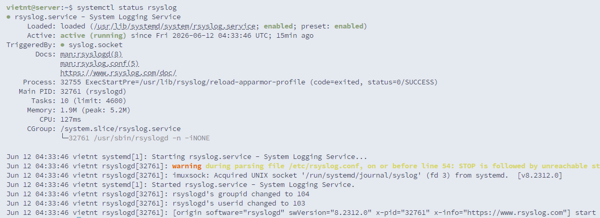
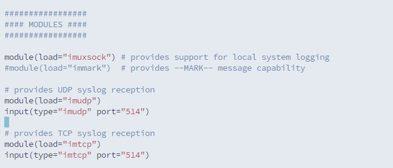
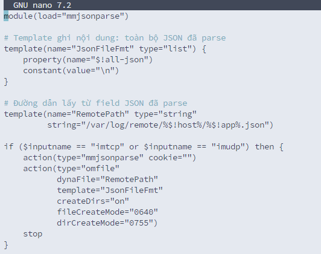
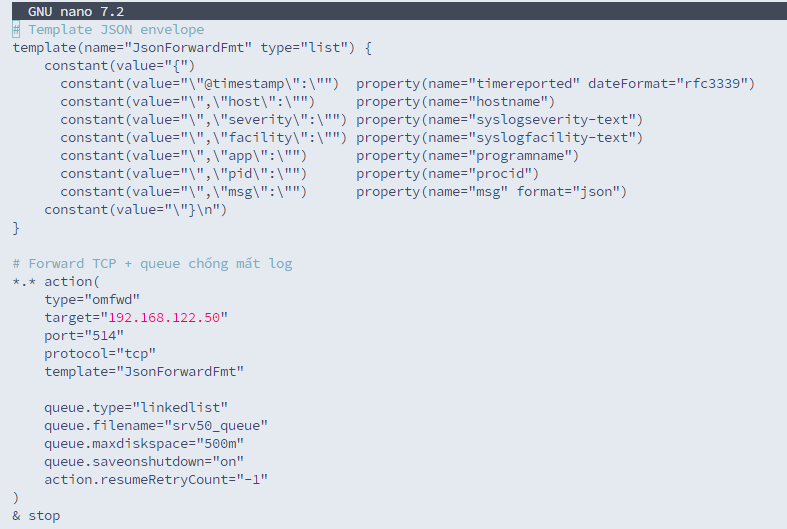
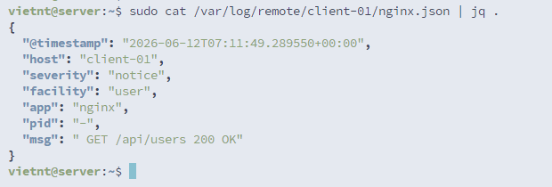

# 1. Cài đặt & Kiểm tra rsyslog


# 2. Cấu hình rsyslog conf


# 2. Gửi log test từ client
## Client
```bash
vietnt@client-01:~$ logger "Hello from client"
vietnt@client-01:~$ logger -t nginx "Access test"
```

## Server
```bash
vietnt@server:~$ grep -R "Hello from client" /var/log/remote
/var/log/remote/client-01/vietnt.log:2026-06-12T05:03:19+00:00 client-01 vietnt: Hello from client
vietnt@server:~$ cat /var/log/remote/client-01/nginx.log
2026-06-12T06:05:09+00:00 client-01 nginx: Access test
```

# 3. Ví dụ cấu hình một số loại log

Forward log tới syslog server `192.168.122.50` qua TCP (`@@`).

| Nhóm log | Selector | Mô tả |
|---|---|---|
| **Security** | `auth,authpriv.*` | SSH, sudo, su, PAM |
| **System errors** | `kern.warning` | Kernel warning/error |
|  | `*.err` | Tất cả lỗi từ mọi facility |
| **Important events** | `daemon.warning` | Dịch vụ hệ thống |
|  | `mail.warning` | Mail server (nếu có) |
|  | `cron.warning` | Cron lỗi/cảnh báo |
| **Custom apps** | `local0.* … local3.*` | Facility dành cho ứng dụng tự phát triển |

File `/etc/rsyslog.d/50-forward.conf`:

```rsyslog
# Security
auth,authpriv.*        @@192.168.122.50:514

# System errors
kern.warning           @@192.168.122.50:514
*.err                  @@192.168.122.50:514

# Important events
daemon.warning         @@192.168.122.50:514
mail.warning           @@192.168.122.50:514
cron.warning           @@192.168.122.50:514

# Custom applications (local0-local3)
local0.*               @@192.168.122.50:514
local1.*               @@192.168.122.50:514
local2.*               @@192.168.122.50:514
local3.*               @@192.168.122.50:514

# Chặn xử lý trùng lặp
& stop
```

# 4. Thử setup parse log json

> **Topology:**
> - Server log (nhận log): `192.168.122.50`
> - Client (gửi log): `192.168.122.52` — hostname `client-01`

## 4.1. Cấu hình SERVER (192.168.122.50)
### Tạo config nhận + parse JSON
File `/etc/rsyslog.d/30-server-receive-json.conf`:



### Mở firewall + restart
```bash
sudo ufw allow 514/tcp
sudo rsyslogd -N1
sudo systemctl restart rsyslog
sudo ss -ltnp | grep 514     # LISTEN 0.0.0.0:514
```

---

## 4.2. Cấu hình CLIENT (192.168.122.52)
### Tạo config forward JSON
File `/etc/rsyslog.d/90-client-forward-json.conf`:



### Validate + restart
```bash
sudo rsyslogd -N1
sudo systemctl restart rsyslog
```

---

## 4.3. Test gửi log

### Trên CLIENT
```bash
vietnt@client-01:~$ logger -t nginx "GET /api/users 200 OK"
```

### Trên SERVER — verify
```bash
vietnt@server:~$ sudo cat /var/log/remote/client-01/nginx.json | jq .
{
  "@timestamp": "2026-06-12T07:11:49.289550+00:00",
  "host": "client-01",
  "severity": "notice",
  "facility": "user",
  "app": "nginx",
  "pid": "-",
  "msg": " GET /api/users 200 OK"
}
```

