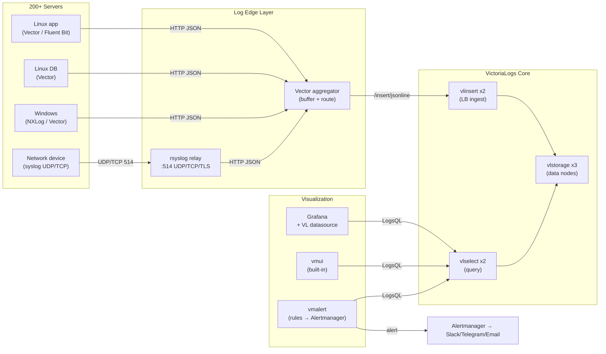
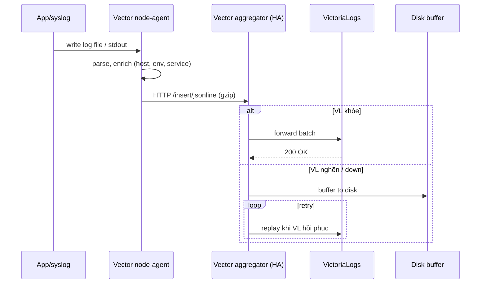
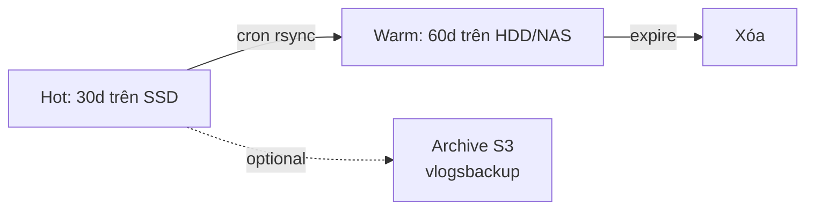

# Ứng dụng thực tế VictoriaLogs — Triển khai log tập trung cho 200+ server

> Hướng dẫn thiết kế và triển khai hệ thống log tập trung dùng **VictoriaLogs (VL)** cho hạ tầng ~200 server (Linux/Windows, app + DB + network device).
> Áp dụng các nguyên tắc **KISS – YAGNI – DRY**: bắt đầu đơn giản, scale khi cần.

---

## 1. Giả định bài toán

| Hạng mục | Giá trị giả định |
|---|---|
| Số server | 200+ |
| OS | Đa số Linux, một phần Windows |
| Loại log | syslog, app log (JSON/text), web access, DB slow query, audit |
| Tốc độ ingest ước tính | 5k–50k log/s (≈ 50–500 GB/ngày raw) |
| Retention mong muốn | 30 ngày hot, 90 ngày tổng |
| SLA truy vấn | < 3s cho query 24h gần nhất |
| Người dùng | DevOps, SRE, Security, App team |

> Nếu thực tế lệch nhiều (ví dụ 5 TB/ngày), cần điều chỉnh sizing ở mục 6.

---

## 2. Kiến trúc tổng thể

### 2.1. Diagram tổng



### 2.2. Tầng (layers)

| Tầng | Thành phần | Trách nhiệm |
|---|---|---|
| **Source** | 200 server | Sinh log |
| **Collector** (node-level) | Vector / Fluent Bit / NXLog | Đọc file, parse JSON, gắn metadata, gửi đi |
| **Edge** | rsyslog relay + Vector aggregator | Nhận syslog, gom log, buffer khi VL nghẽn, route theo tenant |
| **Core** | vlinsert / vlstorage / vlselect | Ingest, store, query |
| **UI/Alert** | Grafana, vmui, vmalert | Trực quan, cảnh báo |

---

## 3. Chọn collector cho từng loại server

| Loại server | Collector đề xuất | Lý do |
|---|---|---|
| Linux app/web (nhiều) | **Vector** | Hiệu năng cao, transform mạnh, cấu hình TOML rõ ràng |
| Linux nhẹ / edge | **Fluent Bit** | RAM <20MB, tốt cho thiết bị yếu |
| Windows server | **Vector** (Windows build) hoặc **NXLog CE** | Đọc Event Log dễ |
| Network device, firewall | gửi thẳng **syslog** → rsyslog relay | Không cài agent được |
| Container/K8s (nếu có) | Fluent Bit DaemonSet | Chuẩn cloud-native |

> **Brutal honesty:** Đừng dùng Logstash. Nặng JVM, dư thừa với VL.

---

## 4. Mô hình triển khai VL

### Option A — Single-node (khuyến nghị khởi đầu)
- 1 VM/bare-metal cấu hình mạnh chạy 1 binary `victoria-logs`.
- **Phù hợp khi:** < 200 GB/ngày, < 30k log/s.
- **Ưu:** đơn giản nhất, 1 process, 1 file config, backup = rsync.
- **Nhược:** không HA. Mất node = không ingest được tạm thời (agent buffer cứu).

### Option B — Cluster (vlinsert + vlstorage + vlselect)
- 2 vlinsert, 3 vlstorage, 2 vlselect.
- **Phù hợp khi:** > 200 GB/ngày, cần HA, scale ngang.
- **Ưu:** HA, replicate, scale từng tầng độc lập.
- **Nhược:** vận hành phức tạp hơn, cần load balancer.

### Khuyến nghị cho 200 server
**Bắt đầu single-node + Vector aggregator HA (2 node) → nâng cấp cluster khi vượt ngưỡng.**
Lý do: YAGNI. Phần lớn fleet 200 server sinh < 300 GB/ngày — single-node đủ. Vector aggregator HA đã đảm bảo agent không mất log khi VL restart.

---

## 5. Pipeline ingest chi tiết



**Nguyên tắc:**
- Mỗi log gắn sẵn `stream fields`: `host`, `env`, `service`, `datacenter`.
- Aggregator có **disk buffer** ≥ 10 GB → chịu được VL down 1–2 giờ.
- Dùng `gzip` cho payload → giảm 5–10× băng thông.

---

## 6. Sizing & hạ tầng

### Single-node VL cho 200 server (~200 GB/ngày raw)

| Tài nguyên | Khuyến nghị |
|---|---|
| CPU | 8–16 vCPU |
| RAM | 16–32 GB |
| Disk | NVMe SSD, ≥ 1 TB (sau nén ~50:1 ⇒ 30d retention chỉ chiếm ~120 GB, nhưng dự phòng) |
| Network | 1 Gbps |
| OS | Ubuntu 22.04 LTS / Rocky 9 |

### Vector aggregator (2 node HA)

| Tài nguyên | Khuyến nghị |
|---|---|
| CPU | 4 vCPU |
| RAM | 8 GB |
| Disk | 50 GB (buffer) |

### Grafana / vmalert
- 1 VM dùng chung: 2 vCPU / 4 GB / 50 GB.

> **Reality check:** Với VL, 1 TB SSD lưu được hàng tháng log của 200 server. Không cần đầu tư SAN/object storage giai đoạn đầu.

---

## 7. Phân loại log & stream fields

| Stream field | Ví dụ | Mục đích |
|---|---|---|
| `host` | `web-01.dc1` | Lọc theo máy |
| `env` | `prod`, `staging` | Tách môi trường |
| `service` | `nginx`, `mysql`, `auth-api` | Tách ứng dụng |
| `datacenter` | `hn`, `sg` | Phân vùng địa lý |
| `log_type` | `access`, `error`, `audit`, `syslog` | Routing & retention khác nhau |

**Cảnh báo:** KHÔNG đưa high-cardinality vào stream fields (`trace_id`, `request_id`, `user_id`) — gây bùng nổ stream. Để chúng là log fields thường.

---

## 8. Bảo mật

| Lớp | Biện pháp |
|---|---|
| Truyền tải | TLS giữa agent ↔ aggregator ↔ VL |
| Xác thực ingest | Basic auth hoặc mTLS trên `vlinsert` |
| Xác thực query | Reverse proxy (Nginx/Caddy) + OIDC (Authelia/Keycloak) trước `vlselect` |
| PII/secrets | Vector `remap` mask `password=`, `token=`, số thẻ |
| Multi-tenant | Header `AccountID`/`ProjectID` để tách team |
| Audit | Bật access log Nginx → đẩy vào chính VL |

---

## 9. Retention & lifecycle



- `-retentionPeriod=30d` cho hot.
- `-retention.maxDiskSpaceUsageBytes` đặt safety net (vd 80% disk).
- Backup hàng đêm bằng `vmbackup`-style script (rsync partition cũ).

---

## 10. Monitoring & alerting

| Cần monitor | Metric/Source |
|---|---|
| VL ingest rate, RAM, disk | `/metrics` Prometheus của VL |
| Vector aggregator backpressure | Vector `/metrics` |
| Disk usage VL | node_exporter |
| Log error trend | LogsQL alert qua `vmalert` |

**Ví dụ alert (LogsQL trong vmalert):**
```logsql
_time:5m service:auth-api level:error | stats count() as errors
# alert nếu errors > 100
```

---

## 11. UI review — bố cục Grafana

```
┌──────────────────────────────────────────────────────────────────┐
│  [Logo]  Centralized Logging — VictoriaLogs                      │
│  Env: prod ▼   DC: all ▼   Service: all ▼   Time: last 1h ▼      │
├──────────────────────────────────────────────────────────────────┤
│ ┌───────────────┐ ┌───────────────┐ ┌───────────────┐ ┌────────┐ │
│ │ Logs/s        │ │ Error rate    │ │ Top services  │ │ Hosts  │ │
│ │   24,318      │ │   0.42%       │ │ 1. nginx 38%  │ │ 198/200│ │
│ │   ▲ 12%       │ │   ▼ 5%        │ │ 2. mysql 19%  │ │ alive  │ │
│ └───────────────┘ └───────────────┘ └───────────────┘ └────────┘ │
├──────────────────────────────────────────────────────────────────┤
│  📈 Log volume by service (stacked area, 1h)                     │
│  ┌────────────────────────────────────────────────────────────┐  │
│  │ ███▓▓▓▒▒▒░░░  nginx  mysql  auth  worker  cron             │  │
│  └────────────────────────────────────────────────────────────┘  │
├──────────────────────────────────────────────────────────────────┤
│  🔥 Top error messages (table)                                   │
│  ┌────────────────────────────────────────────────────────────┐  │
│  │ #  count  service     message                              │  │
│  │ 1  1,204  auth-api    "JWT expired"                        │  │
│  │ 2    803  mysql       "Lock wait timeout"                  │  │
│  │ 3    412  nginx       "upstream timed out"                 │  │
│  └────────────────────────────────────────────────────────────┘  │
├──────────────────────────────────────────────────────────────────┤
│  📜 Live tail   [▶ playing]                                      │
│  ┌────────────────────────────────────────────────────────────┐  │
│  │ 16:01:23 web-03 nginx  200 GET /api/users  12ms            │  │
│  │ 16:01:23 db-01  mysql  slow_query 1.2s SELECT * FROM ...   │  │
│  │ 16:01:24 web-07 nginx  500 POST /api/pay   2.4s            │  │
│  └────────────────────────────────────────────────────────────┘  │
└──────────────────────────────────────────────────────────────────┘
```

**Nguyên tắc UX:**
- 4 KPI ở top (logs/s, error rate, top service, hosts alive) — nhìn 3 giây hiểu tình hình.
- 1 panel time-series khối lượng log theo service.
- 1 panel top errors (clickable → drill-down LogsQL).
- 1 panel live tail (giống `tail -f` toàn fleet).
- Filter dropdown: env / DC / service / time → áp dụng cho cả dashboard.

### Dashboard set đề xuất
1. **Fleet Overview** — KPI toàn 200 server.
2. **Service Deep-dive** — chọn service, xem error/latency/log stream.
3. **Security/Audit** — sshd, sudo, auth fail, geo IP.
4. **Network Devices** — log syslog từ switch/firewall.
5. **Live Tail** — xem stream realtime, filter theo host/service.

---

## 12. Lộ trình triển khai (4 tuần)

| Tuần | Việc | Kết quả |
|---|---|---|
| **W1** | Cài VL single-node + Grafana + Vector aggregator HA. Test với 5 server. | PoC chạy được, dashboard cơ bản |
| **W2** | Rollout Vector agent cho 50 server đầu (web/app). Thiết lập rsyslog relay cho network device. | 50 server gửi log đều, retention 7d |
| **W3** | Mở rộng 200 server. Tinh chỉnh stream fields, parsing rule, mask PII. Thiết lập vmalert + Alertmanager. | Toàn fleet log tập trung, alert chạy |
| **W4** | Tunning retention 30d, backup, viết runbook, đào tạo team. | Production-ready, vận hành ổn định |

---

## 13. Rủi ro & giảm thiểu

| Rủi ro | Mức | Giảm thiểu |
|---|---|---|
| Log bùng nổ (DEBUG mở nhầm prod) | Cao | Vector rate-limit per host; alert khi logs/s vượt baseline |
| Disk VL đầy | Cao | `-retention.maxDiskSpaceUsageBytes` + alert > 70% |
| Mất log khi VL down | Trung bình | Aggregator disk buffer + agent retry |
| Stream cardinality cao | Trung bình | Code review collector config, cấm field high-cardinality làm stream |
| Rò rỉ PII | Cao | Mask ở Vector trước khi rời server |
| Single-node VL crash | Trung bình | Nâng cấp cluster khi vượt 300 GB/ngày |

---

## 14. Khi nào nâng cấp lên cluster?

Chuyển sang Option B khi gặp ≥ 2 dấu hiệu:
- Ingest > 50k log/s đều đặn.
- Disk node đơn vượt 1 TB sau nén.
- Query 24h > 5s.
- Yêu cầu uptime ≥ 99.9% (SLA chính thức).
- Cần multi-DC active-active.

---

## 15. Bottom line

> Với 200 server, **single-node VL + Vector HA aggregator + Grafana** là kiến trúc đủ tốt, đơn giản, rẻ.
> Tổng nhân lực: 1 SRE 4 tuần. Tổng phần cứng: 3 VM. TCO ~1/10 so với ELK tương đương.
> Đừng over-engineer cluster ngay từ đầu — scale khi data thực sự yêu cầu.

---

## 16. Câu hỏi còn mở

1. Có yêu cầu compliance cụ thể (PCI-DSS, ISO 27001, SOC2)? → ảnh hưởng retention, encryption-at-rest, audit trail.
2. Network có cho phép agent → VL trực tiếp, hay phải qua proxy/DMZ?
3. Có sẵn Grafana đang dùng cho metrics không? → tái sử dụng, không deploy mới.
4. Khối lượng log thực tế (đã đo chưa)? → quyết định single-node vs cluster.
5. Có cần long-term archive (> 1 năm) lên S3/object storage không?
6. Windows server chiếm bao nhiêu %? → quyết định cài Vector hay NXLog.
