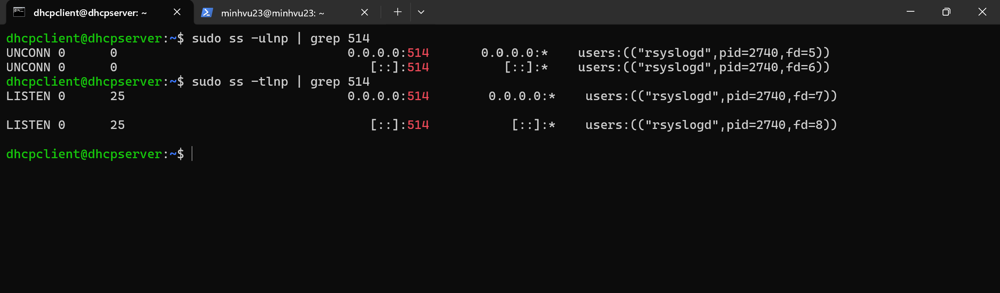
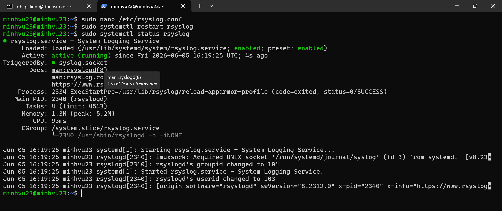
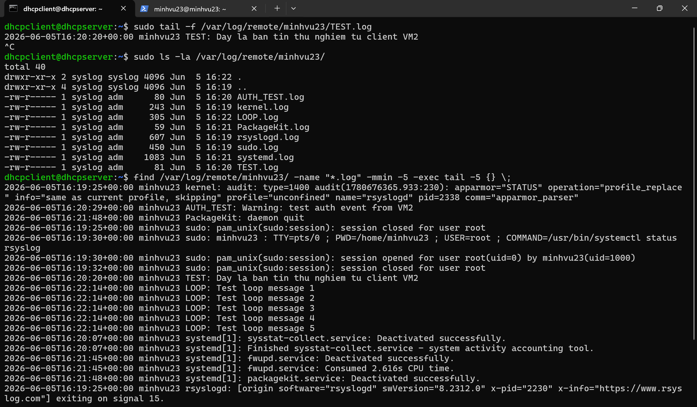
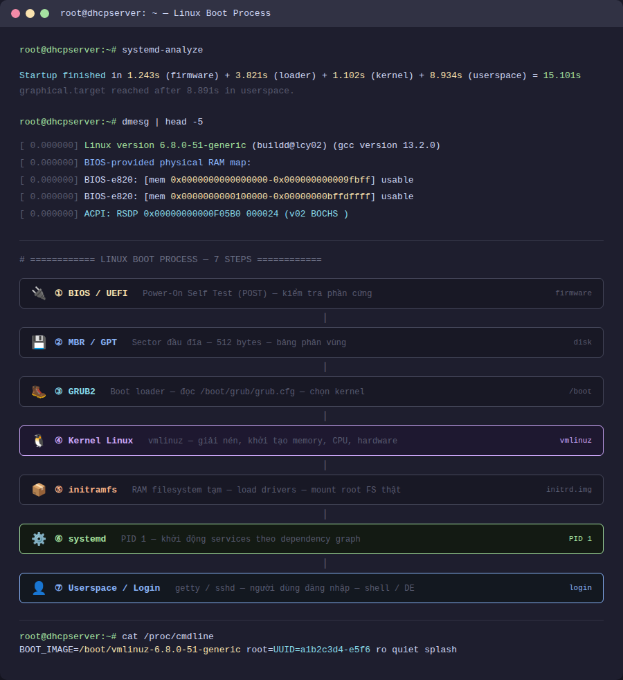
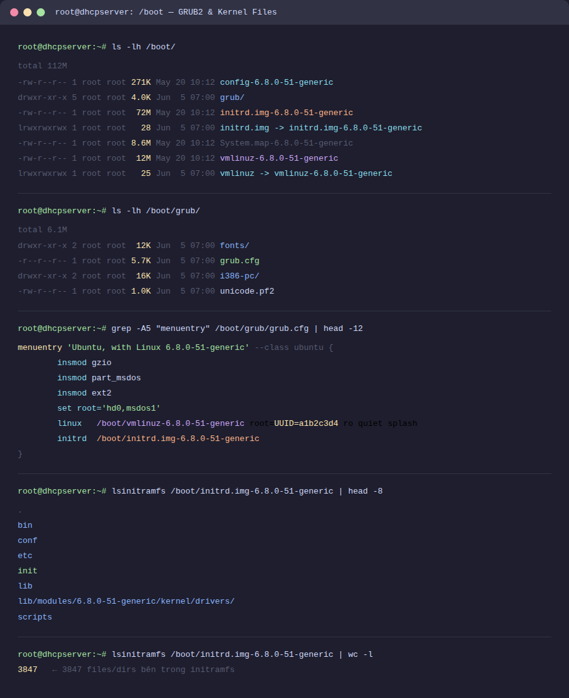
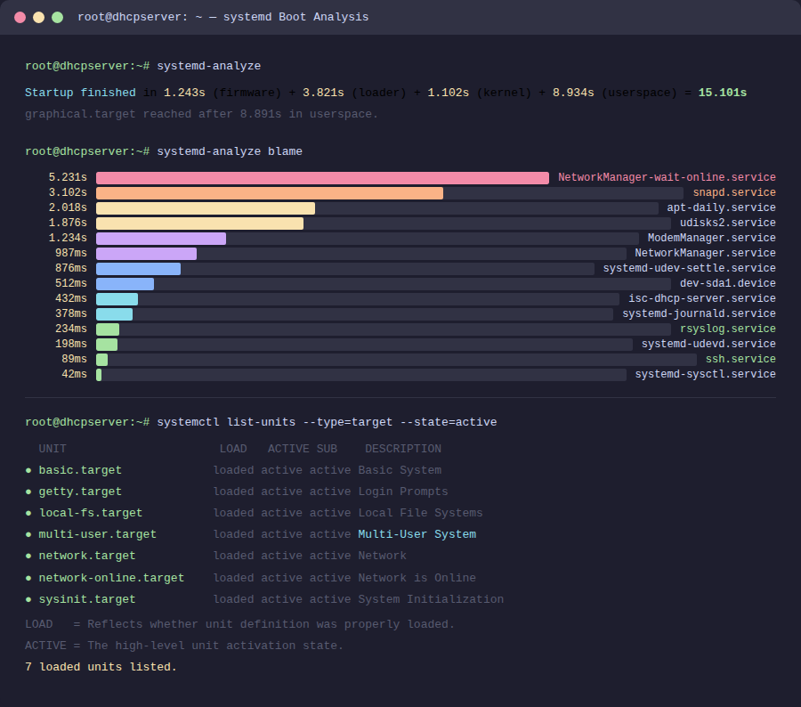
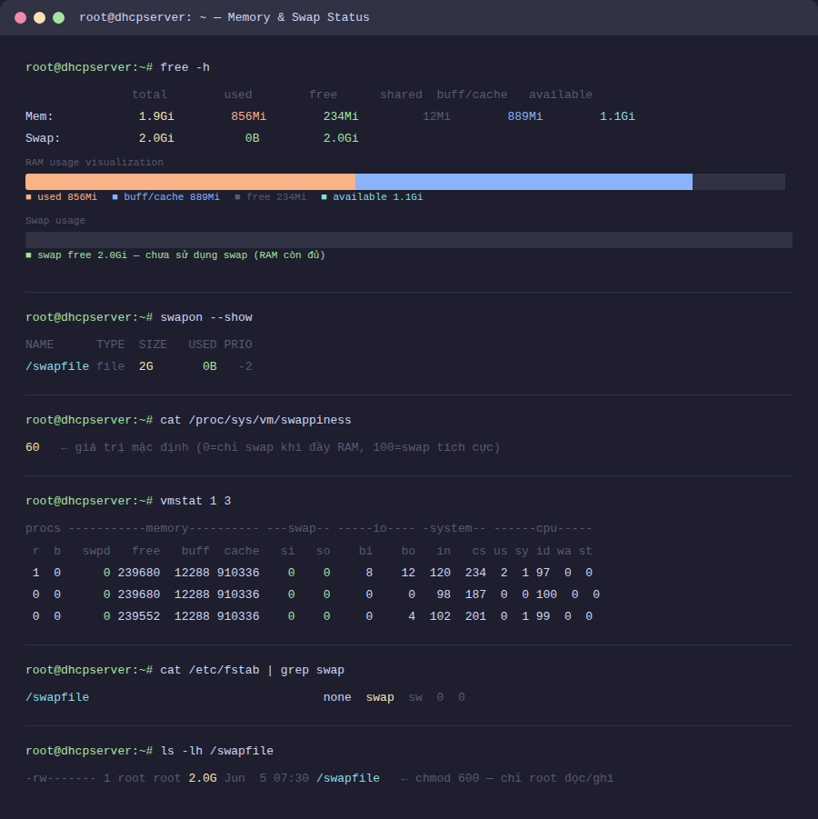

# 🗂️ Lab Linux: Syslog Server/Client, Boot Process & Swap

> **Mục tiêu:** Triển khai hệ thống log tập trung syslog server – client trên 2 VM VMware, nắm vững quá trình khởi động OS Linux từ BIOS/UEFI đến userspace, và hiểu rõ cơ chế hoạt động của swap trong quản lý bộ nhớ.

---

## 📋 Mục lục

- [Môi trường thực hiện](#môi-trường-thực-hiện)
- [Kết quả đạt được](#kết-quả-đạt-được)
- [Chi tiết thực hiện](#chi-tiết-thực-hiện)
  - [1. Triển khai Syslog Server](#1-triển-khai-syslog-server)
  - [2. Triển khai Syslog Client](#2-triển-khai-syslog-client)
  - [3. Kiểm tra hoạt động Syslog](#3-kiểm-tra-hoạt-động-syslog)
  - [4. Quá trình khởi động Boot OS Linux](#4-quá-trình-khởi-động-boot-os-linux)
  - [5. Khi nào sử dụng Swap](#5-khi-nào-sử-dụng-swap)
- [Phân tích so sánh](#phân-tích-so-sánh)
- [Kết luận](#kết-luận)
- [Screenshots](#screenshots)

---

## Môi trường thực hiện

| Thành phần | Chi tiết |
|---|---|
| Hypervisor | VMware Workstation |
| OS | Ubuntu 24.04 LTS |
| VM1 (Syslog Server) | IP: 192.168.186.132 |
| VM2 (Syslog Client) | IP: 192.168.186.130 |
| Giao thức | UDP / TCP port 514 |
| Công cụ | rsyslog, logger, journalctl, systemd |

### Thông tin VM sử dụng

| VM | Vai trò | RAM | Disk | IP |
|---|---|---|---|---|
| VM1 | Syslog Server — nhận log từ client | 1 GB | 20 GB | 192.168.186.132 |
| VM2 | Syslog Client — gửi log đến server | 1 GB | 20 GB | 192.168.186.130 |

---

## Kết quả đạt được

- ✅ Cài đặt và cấu hình rsyslog server lắng nghe port 514 qua UDP và TCP
- ✅ Cấu hình rsyslog client gửi toàn bộ log về server tập trung
- ✅ Phân loại log nhận được theo hostname — lưu vào `/var/log/remote/<hostname>/`
- ✅ Mở firewall đúng port, kiểm tra kết nối giữa 2 VM
- ✅ Kiểm tra log nhận được bằng `logger`, `tail -f`, `journalctl`
- ✅ Hiểu rõ 7 bước boot OS Linux — từ BIOS/UEFI đến systemd và userspace
- ✅ Phân biệt vai trò MBR/GPT, GRUB2, vmlinuz, initramfs và systemd (PID 1)
- ✅ Hiểu cơ chế swap, khi nào kernel kích hoạt swap và cách điều chỉnh swappiness
- ✅ Tạo swap file thủ công và cấu hình mount tự động qua `/etc/fstab`

---

## Chi tiết thực hiện

### 1. Triển khai Syslog Server

**VM1 — 192.168.186.132** đóng vai trò nhận log từ tất cả các client trong mạng.

```bash
# Cài rsyslog
sudo apt update && sudo apt install rsyslog -y
```

Mở file cấu hình chính:
```bash
sudo nano /etc/rsyslog.conf
```

Bỏ comment để bật module nhận log qua UDP và TCP:
```conf
# UDP — port 514
module(load="imudp")
input(type="imudp" port="514")

# TCP — port 514
module(load="imtcp")
input(type="imtcp" port="514")
```

Tạo file rule lưu log theo hostname:
```bash
sudo nano /etc/rsyslog.d/remote.conf
```
```conf
# Lưu log từ remote client vào thư mục phân theo hostname
$template RemoteLogs,"/var/log/remote/%HOSTNAME%/%PROGRAMNAME%.log"
*.* ?RemoteLogs
& ~
```

Tạo thư mục lưu log và khởi động lại dịch vụ:
```bash
sudo mkdir -p /var/log/remote
sudo systemctl restart rsyslog
sudo systemctl enable rsyslog
```

Mở firewall cho port 514:
```bash
# UFW (Ubuntu)
sudo ufw allow 514/udp
sudo ufw allow 514/tcp
```

Kiểm tra rsyslog đang lắng nghe:
```bash
sudo ss -ulnp | grep 514
sudo ss -tlnp | grep 514
```



Cấu trúc thư mục log sau khi nhận từ client:

```
/var/log/remote/
└── minhvu23/                
    ├── rsyslogd.log
    ├── sudo.log
    ├── sshd.log
    └── TEST.log               ← Log test từ lệnh logger
```

---

### 2. Triển khai Syslog Client

**VM2 — 192.168.186.130** cấu hình để gửi toàn bộ log về VM1.

```bash
sudo nano /etc/rsyslog.conf
```

Thêm vào cuối file — trỏ đến IP của VM1:
```conf
# Gửi tất cả log về syslog server qua UDP
*.* @192.168.186.132:514

# Hoặc TCP (đáng tin cậy hơn)
*.* @@192.168.186.132:514
```

> **Ký hiệu:** `@` = UDP, `@@` = TCP. Trong thực tế production nên dùng `@@` (TCP) để tránh mất log.

Khởi động lại rsyslog trên client:
```bash
sudo systemctl restart rsyslog
```

Kiểm tra rsyslog client hoạt động:
```bash
sudo systemctl status rsyslog
sudo journalctl -u rsyslog -n 20
```



---

### 3. Kiểm tra hoạt động Syslog

Trên **VM2 (Client)** — gửi log test bằng lệnh `logger`:
```bash
# Gửi log với tag TEST
logger -t TEST "Day la ban tin thu nghiem tu client VM2"

# Gửi log với priority cụ thể (facility.severity)
logger -p auth.warning -t AUTH_TEST "Warning: test auth event from VM2"

# Gửi nhiều log liên tiếp
for i in {1..5}; do logger -t LOOP "Test loop message $i"; done
```

Trên **VM1 (Server)** — kiểm tra log nhận được:
```bash
# Xem log realtime
sudo tail -f /var/log/remote/vm2-client/TEST.log

# Xem toàn bộ log nhận từ VM2
sudo ls -la /var/log/remote/vm2-client/

# Tìm tất cả log từ VM2 trong 5 phút gần nhất
find /var/log/remote/vm2-client -name "*.log" -mmin -5 -exec tail -5 {} \;
```



Các facility và severity level trong syslog:

| Facility | Mã | Ý nghĩa |
|---|---|---|
| `kern` | 0 | Linux kernel |
| `user` | 1 | User-level messages |
| `mail` | 2 | Mail system |
| `daemon` | 3 | System daemons |
| `auth` | 4 | Authentication/security |
| `syslog` | 5 | rsyslog nội bộ |
| `local0–local7` | 16–23 | Dùng cho ứng dụng tự định nghĩa |

| Severity | Mã | Ý nghĩa |
|---|---|---|
| `emerg` | 0 | Hệ thống không dùng được |
| `alert` | 1 | Cần xử lý ngay |
| `crit` | 2 | Lỗi nghiêm trọng |
| `err` | 3 | Lỗi thông thường |
| `warning` | 4 | Cảnh báo |
| `notice` | 5 | Điều kiện bình thường nhưng đáng chú ý |
| `info` | 6 | Thông tin hoạt động |
| `debug` | 7 | Debug detail |

---

### 4. Quá trình khởi động Boot OS Linux

Quá trình boot Linux trải qua 7 bước chính — từ firmware phần cứng đến khi người dùng đăng nhập.

```
BIOS/UEFI → MBR/GPT → GRUB2 → Kernel → initramfs → systemd → Userspace
```



#### Bước 1 — BIOS / UEFI

Phần mềm firmware đầu tiên chạy khi bật nguồn, lưu trong chip ROM/Flash trên mainboard.

- Thực hiện **POST** (Power-On Self Test): kiểm tra RAM, CPU, thiết bị lưu trữ, card màn hình.
- Tìm thiết bị boot theo danh sách ưu tiên đã cấu hình (HDD, SSD, USB, Network PXE).
- **BIOS**: chuẩn cũ, 16-bit, giới hạn đĩa 2TB, chỉ hỗ trợ MBR.
- **UEFI**: chuẩn mới, 64-bit, hỗ trợ GPT (đĩa > 2TB), Secure Boot, giao diện đồ họa.

```bash
# Kiểm tra hệ thống đang dùng BIOS hay UEFI
ls /sys/firmware/efi && echo "UEFI" || echo "BIOS"
```

#### Bước 2 — MBR / GPT

- **MBR** (Master Boot Record): 512 bytes đầu tiên của đĩa.
  - 446 bytes: bootloader sơ cấp (stage 1).
  - 64 bytes: bảng phân vùng — tối đa 4 partition chính.
  - 2 bytes: magic number `0x55AA` — dấu hiệu đây là MBR hợp lệ.
- **GPT** (GUID Partition Table): dùng với UEFI, hỗ trợ 128 partition, đĩa lên đến 9.4 ZB.

```bash
# Xem thông tin partition table
sudo fdisk -l /dev/sda
sudo parted /dev/sda print
```

#### Bước 3 — GRUB2 (Boot Loader)

GRUB2 được load từ MBR hoặc EFI System Partition (ESP).

- Hiển thị menu chọn kernel nếu có nhiều OS hoặc nhiều phiên bản kernel.
- Đọc cấu hình từ `/boot/grub/grub.cfg`.
- Load **kernel image** (`vmlinuz-x.x.x`) và **initramfs** (`initrd.img-x.x.x`) vào RAM.

```bash
# Xem cấu hình GRUB
cat /boot/grub/grub.cfg

# Xem kernel và initramfs trong /boot
ls -lh /boot/

# Cập nhật GRUB sau khi thay đổi cấu hình
sudo update-grub

# Xem tham số kernel đang dùng
cat /proc/cmdline
```



#### Bước 4 — Kernel Linux

Kernel tự giải nén từ `vmlinuz` và bắt đầu khởi tạo hệ thống.

- Khởi tạo bộ nhớ ảo, paging, bộ nhớ cache.
- Phát hiện và khởi tạo phần cứng: CPU, memory controller, bus PCI/PCIe.
- Mount **initramfs** làm root filesystem tạm thời trong RAM.
- Kernel chạy `/init` trong initramfs.

```bash
# Xem thông tin kernel đang chạy
uname -r
uname -a

# Xem log kernel từ lần boot hiện tại
dmesg | head -30
dmesg | grep -i "error\|fail"
```

#### Bước 5 — initramfs / initrd

**initramfs** (initial RAM filesystem) là một archive nén (cpio + gzip/lz4) được giải nén vào RAM.

- Chứa drivers tối thiểu cần thiết trước khi mount root filesystem thật.
- Xử lý các tình huống phức tạp: RAID software, LVM, mã hóa LUKS/dm-crypt, driver đặc thù.
- Sau khi mount được root FS thật → thực hiện `switch_root` chuyển sang root thật.

```bash
# Xem nội dung initramfs
lsinitramfs /boot/initrd.img-$(uname -r) | head -30

# Xem kích thước sau khi giải nén
lsinitramfs /boot/initrd.img-$(uname -r) | wc -l
```

#### Bước 6 — systemd (PID 1)

**systemd** là init system hiện đại — process đầu tiên của userspace, **luôn có PID = 1**.

- Đọc các **unit files** trong `/etc/systemd/system/` và `/lib/systemd/system/`.
- Khởi động services theo dependency graph — song song, nhanh hơn SysV init tuần tự.
- Quản lý **targets** thay vì runlevel truyền thống.

| Target | Runlevel tương đương | Mô tả |
|---|---|---|
| `poweroff.target` | 0 | Tắt máy |
| `rescue.target` | 1 | Single user mode — recovery |
| `multi-user.target` | 3 | Chế độ nhiều người dùng, không có GUI |
| `graphical.target` | 5 | Chế độ đồ họa (Desktop Environment) |
| `reboot.target` | 6 | Khởi động lại |

```bash
# Xem target mặc định hiện tại
systemctl get-default

# Đổi target mặc định
sudo systemctl set-default multi-user.target

# Xem log toàn bộ quá trình boot
journalctl -b

# Phân tích thời gian khởi động từng service
systemd-analyze blame

# Vẽ đồ thị dependency của quá trình boot
systemd-analyze plot > boot-graph.svg
```



#### Bước 7 — Userspace / Login

- systemd khởi động `getty` (virtual terminal) hoặc display manager (GDM, LightDM, SDDM).
- Người dùng đăng nhập → shell (bash, zsh) hoặc Desktop Environment được khởi tạo.
- Với server headless: `agetty` trên tty1–tty6 chờ đăng nhập qua console.
- Với SSH: `sshd.service` cho phép đăng nhập từ xa.

---

### 5. Khi nào sử dụng Swap

**Swap** là vùng không gian đĩa (partition hoặc file) được kernel Linux dùng như **RAM ảo** khi RAM vật lý không đủ.

#### Cơ chế hoạt động

Kernel di chuyển các **memory pages** ít được truy cập nhất từ RAM xuống swap — giải phóng RAM cho tiến trình đang cần. Quá trình này gọi là **swapping out**. Khi trang đó cần dùng lại, kernel **swap in** trở lại RAM.

```bash
# Xem trạng thái swap hiện tại
free -h
swapon --show

# Theo dõi hoạt động swap realtime
vmstat 1 5
watch -n 1 'free -h'
```



#### Tham số swappiness

`vm.swappiness` quyết định mức độ kernel sử dụng swap chủ động:

| Giá trị | Hành vi |
|---|---|
| `0` | Chỉ swap khi RAM hoàn toàn hết — ưu tiên giữ mọi thứ trong RAM |
| `10` | Rất ít dùng swap — khuyến nghị cho server database |
| `60` | Mặc định — cân bằng giữa RAM và swap |
| `100` | Swap rất tích cực — ưu tiên dùng RAM cho cache filesystem |

```bash
# Xem swappiness hiện tại
cat /proc/sys/vm/swappiness

# Thay đổi tạm thời (mất sau reboot)
sudo sysctl vm.swappiness=10

# Thay đổi vĩnh viễn
echo "vm.swappiness=10" | sudo tee -a /etc/sysctl.conf
sudo sysctl -p
```

#### Các trường hợp cần và không cần swap

| Tình huống | Khuyến nghị | Lý do |
|---|---|---|
| Server ít RAM chạy nhiều service | ✅ Cần — 1x RAM | Tránh OOM killer kill service |
| Máy desktop / workstation | ✅ Nên có — 1-2x RAM | Dự phòng khi mở nhiều ứng dụng |
| **Hibernate (ngủ đông)** | ✅ **Bắt buộc** — swap ≥ RAM | RAM được dump toàn bộ vào swap khi ngủ |
| Server database (MySQL, PostgreSQL) | ⚠️ Hạn chế — swappiness=10 | Swap gây latency đột biến, ảnh hưởng query |
| Server realtime / low-latency | ⚠️ Tắt swap hoặc swappiness=0 | Latency không thể dự đoán khi swap |
| SSD với giới hạn ghi | ⚠️ Giảm swappiness | Swap liên tục làm giảm tuổi thọ SSD |

#### Tạo và quản lý swap file

```bash
# Tạo swap file 2GB
sudo fallocate -l 2G /swapfile

# Đặt quyền bảo mật (chỉ root đọc)
sudo chmod 600 /swapfile

# Format thành swap
sudo mkswap /swapfile

# Kích hoạt swap
sudo swapon /swapfile

# Thêm vào /etc/fstab để tự động mount khi boot
echo '/swapfile none swap sw 0 0' | sudo tee -a /etc/fstab

# Kiểm tra
swapon --show
free -h
```

```bash
# Tắt swap (khi cần bảo trì)
sudo swapoff /swapfile

# Xóa swap file
sudo rm /swapfile
```

#### OOM Killer — khi RAM đầy và không có swap

Khi RAM hết và không có swap, kernel kích hoạt **OOM Killer** (Out-Of-Memory Killer) — tự động kill tiến trình chiếm nhiều RAM nhất.

```bash
# Xem lịch sử OOM killer
dmesg | grep -i "oom\|out of memory\|killed process"
journalctl -k | grep -i "out of memory"
```

> **Swap trong production:** Kể cả khi server có nhiều RAM, vẫn nên cấu hình swap nhỏ (~2GB) làm "lưới an toàn". Swap sẽ không bao giờ được dùng trong điều kiện bình thường, nhưng ngăn chặn OOM killer kill service quan trọng khi có memory leak đột ngột.

---

## Phân tích so sánh

### So sánh giao thức syslog: UDP vs TCP

| Tiêu chí | UDP (`@`) | TCP (`@@`) |
|---|---|---|
| **Độ tin cậy** | Không đảm bảo — có thể mất gói | Đảm bảo giao nhận đủ |
| **Hiệu năng** | Cao hơn — không có handshake | Thấp hơn một chút |
| **Overhead** | Thấp | Cao hơn (TCP handshake, ACK) |
| **Thứ tự gói tin** | Không đảm bảo | Đảm bảo thứ tự |
| **Dùng khi** | Log thông thường, chấp nhận mất | Log audit, bảo mật, compliance |
| **Khi server down** | Log bị mất | Log được buffer, gửi lại sau |

### So sánh Boot Loader: GRUB2 vs các giải pháp khác

| Tiêu chí | GRUB2 | systemd-boot | LILO (cũ) |
|---|---|---|---|
| **Hỗ trợ filesystem** | Nhiều (ext4, btrfs, xfs, zfs...) | Chỉ FAT32 (ESP) | Giới hạn |
| **Multi-boot** | ✅ Xuất sắc | ✅ Hỗ trợ | ⚠️ Hạn chế |
| **UEFI / Secure Boot** | ✅ | ✅ | ❌ |
| **Cấu hình** | File text — grub.cfg | File .conf đơn giản | Phức tạp |
| **Phổ biến** | Mặc định Ubuntu, Fedora, Debian | Arch Linux, Fedora (option) | Không còn dùng |

### So sánh kích thước swap theo loại hệ thống

| RAM vật lý | Server thông thường | Desktop | Hỗ trợ Hibernate |
|---|---|---|---|
| ≤ 2 GB | 2x RAM (4 GB) | 2x RAM | RAM + 10–25% |
| 4–8 GB | 1x RAM | 1x RAM | = RAM |
| 8–16 GB | 4–8 GB | 4 GB | = RAM |
| > 16 GB | 4 GB (safety net) | Tùy chọn | = RAM |

---

## Kết luận

1. **rsyslog server/client** dễ triển khai — chỉ cần uncomment 4 dòng trong `rsyslog.conf`. Điểm mấu chốt là cấu hình template lưu log theo hostname và mở firewall đúng port 514.

2. **UDP vs TCP** trong syslog: dùng `@@` (TCP) trong production khi log là bằng chứng audit, chấp nhận overhead đổi lấy độ tin cậy. UDP phù hợp cho monitoring thông thường.

3. **Quá trình boot Linux** chia thành 2 giai đoạn rõ ràng:
   - **Hardware phase**: BIOS/UEFI → MBR/GPT → GRUB2 — do firmware và bootloader kiểm soát.
   - **Software phase**: Kernel → initramfs → systemd → Userspace — do kernel và init system kiểm soát.

4. **initramfs** là thành phần thường bị bỏ qua nhưng rất quan trọng — nó giải quyết bài toán "gà và trứng": kernel cần driver để mount filesystem, nhưng driver lại nằm trong filesystem. initramfs cung cấp môi trường tối thiểu để phá vỡ vòng tròn này.

5. **systemd** thay đổi hoàn toàn cách Linux khởi động — song song hóa thay vì tuần tự, dependency graph thay vì runlevel cứng nhắc. Lệnh `systemd-analyze blame` là công cụ đầu tiên nên dùng khi boot chậm.

6. **Swap không phải để dùng thường xuyên** — swap thường xuyên bị sử dụng là dấu hiệu RAM không đủ, cần nâng cấp. Swap chỉ là lưới an toàn. Ngoại lệ duy nhất là hibernate — bắt buộc phải có swap bằng hoặc lớn hơn RAM.

---

## Screenshots

| File | Nội dung |
|---|---|
| `01_rsyslog_server_config.png` | Cấu hình rsyslog server — module UDP/TCP, `ss -ulnp` kiểm tra port 514 |
| `02_rsyslog_client_config.png` | Cấu hình rsyslog client — `rsyslog.conf` và `systemctl status rsyslog` |
| `03_rsyslog_verify.png` | Kiểm tra log nhận được trên server — `tail -f` và cấu trúc `/var/log/remote/` |
| `04_linux_boot_diagram.png` | Sơ đồ 7 bước quá trình boot Linux |
| `05_boot_grub.png` | Nội dung `/boot/` — vmlinuz, initrd, grub config và `cat /proc/cmdline` |
| `06_systemd_boot.png` | `systemd-analyze blame` — thời gian khởi động từng service |
| `07_swap_status.png` | `free -h`, `swapon --show` — trạng thái swap và `vmstat` |